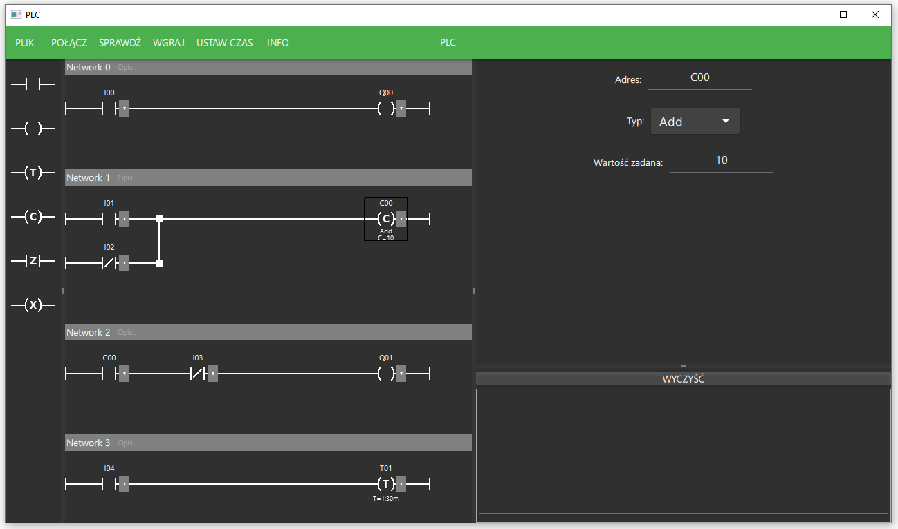
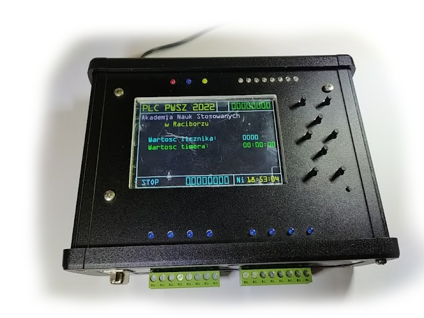

# LadderLogicProgram
This is a program made as part of an engineering project used for programming a PLC controller.
Allows for creating a ladder logic program and uploading it to the controller.

## Table of Contents
* [Program view](#program-view)
* [PLC Controller](#plc-controller)
* [Technologies And Devices Used](#technologies-and-devices-used)
* [Contact](#contact)

## Program view

## PLC Controller
  
The program cooperates with a PLC controller based on STM32 microcontroller, which was created as part of a scientific circle.

## Technologies And Devices Used
- Qt Creator
- C++
- QML
- CMake
- Google test

## Contact
Łukasz Liśnikowski l.lisnikowski@gmail.com  
Project Link: https://github.com/llisnikowski/LadderLogicProgram
